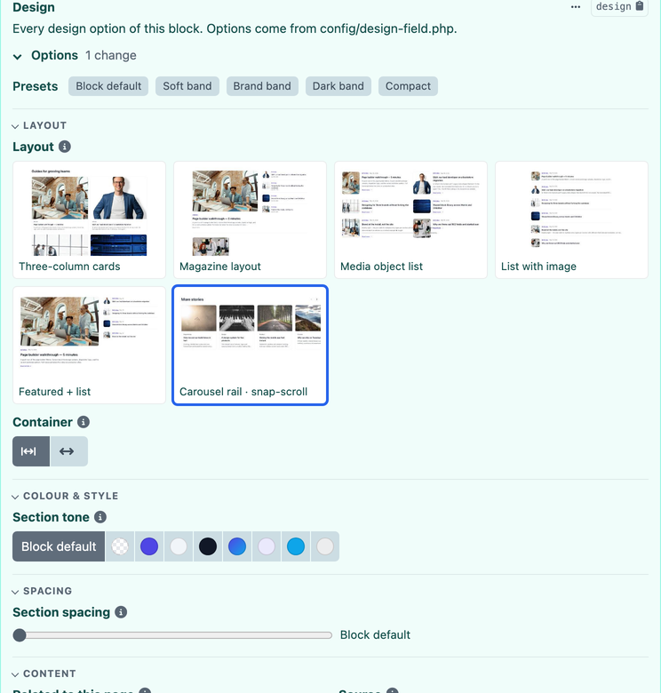
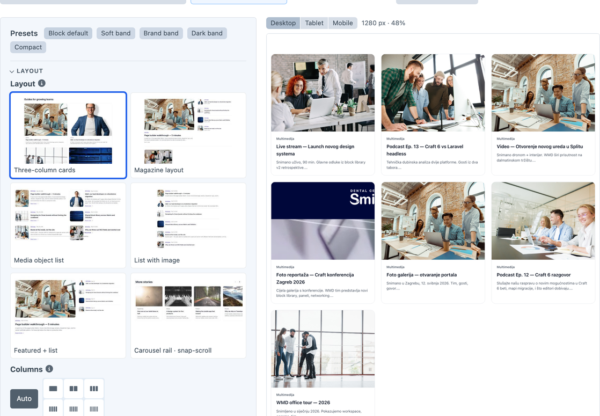
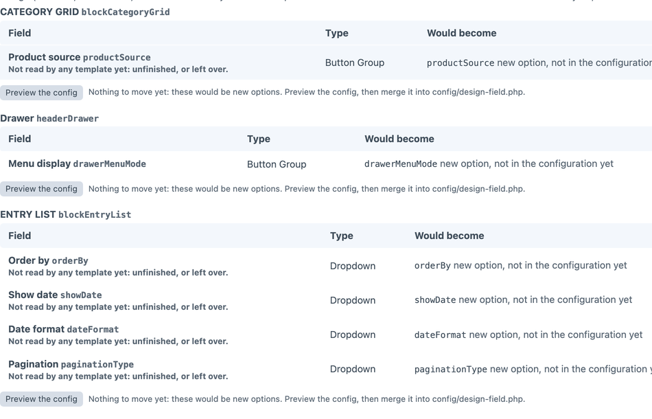

# Design Field for Craft CMS

One field for every design option of a block. Tone, spacing, layout, columns, alignment, card style: instead of a Button Group, a Dropdown and a Lightswitch per option per block, each block gets one compact **Design** panel.

- Editors pick from **named choices**: colour swatches, picture tiles of each layout, sliders for scales, position grids, buttons and dropdowns.
- Options **show only when they apply**: a setting the chosen layout does not use is hidden.
- The field stores **keys** (`{"tone":"surface","columns":"4"}`), never CSS. What a key means lives in config files and templates, so Tailwind sees every class and nobody can type a stray one.
- One reader, `craft.designField.of(block)`, works for the Design field, for the old option fields it replaces, and for showcase mock data, so a site can switch over one block at a time without a page changing.
- Commands generate the configuration from the option fields you already have, move existing content onto the field, and verify every value before old fields are removed.





## Start here

New to Design Field, with no options yet? About ten minutes:

1. **Pick your CSS.** The settings page opens with **Start here**: choose Tailwind CSS, Bootstrap 5 or Plain CSS. Design Field adds five options to every block, Section tone, Section spacing, Container, Alignment and Entrance, with that framework's classes, in the settings tables (Configuration tab), where you can rename, add or remove anything. Each starts at "Block default", so no block changes until an editor picks something.
2. **Add the field.** Create a field of type *Design* and add it to your block entry types (or any entry type).
3. **Read it in the template.** On the block's outer element:
   ```twig
   
   <section class="{{ design.classes('tone', 'spacing') }}">
     <div class="{{ design.classes('container', 'alignment', 'motion') }}">…</div>
   </section>
   ```
4. **Load the stylesheet** once in your layout, for the entrances (and, in Plain CSS, every starter class): ``. Recolour it with custom properties: `:root { --df-brand: #0f766e; }`.
5. **Tailwind only:** Tailwind builds only the classes it finds in your files, and the starter's classes live in project config. Add `@source "../config/project/**/*.yaml";` to your main CSS (path from that file), or keep the classes in a template comment.
6. **Optional, the live preview:** copy `examples/block-preview.twig` (instructions inside) so the settings page shows each block next to its options and can make tile pictures.

Sites that already have option fields: see **Tidy up** below.

## Editions

**Standard** (free) has every feature. **Pro** is for people who like it: nothing is locked, it buys priority answers and a say in the roadmap. The settings page shows one quiet line on Standard ("Like it? Go Pro →") and "Pro ✓" on Pro; there are no banners.

## Requirements

Craft CMS 5.8 or later, PHP 8.2 or later.

## Concepts

- A **group** is one choice: `tone`, `spacing`, `columns`. Its **options** come from a token file (`config/designtokens/{name}.json`, the Design Tokens plugin format) or are listed inline.
- A **profile** says which groups a block shows, and is picked per element, most specific first: `field:type` for a nested entry in one builder (`pageBuilder:blockTeam`), then the type handle (entry type, Commerce product type or category group), then `*`. A profile chosen in the field settings overrides the matching.
- A profile can override a shared group for its block (`'columns' => ['default' => '4']`), or define a group of its own, typically the block's **layout list** (`'variant' => ['options' => [...]]`).

## Configuration

Configure it in **Settings → Plugins → Design Field** (Groups, Options and Profiles tables, stored in project config), or in `config/design-field.php`, which takes over when it defines `groups` or `profiles`:

```php
return [
    // Old option field => group, used when reading or moving old fields.
    'fieldMap' => ['accentToken' => 'tone'],

    'groups' => [
        'tone' => [
            'label' => 'Section tone',
            'instructions' => 'Background and text tone for the whole section.',
            'tokens' => 'accent',                    // config/designtokens/accent.json
            'auto' => 'Block default',               // adds an `auto` option: the template decides
            'input' => 'swatches',
            'optionMeta' => ['primary' => ['swatch' => '#4f46e5']],
        ],
        'columns' => [
            'options' => ['2' => ['label' => '2'], '3' => ['label' => '3'], '4' => ['label' => '4']],
            'default' => '3',
            'input' => 'slider',
            'aliases' => ['three' => '3'],           // renamed keys keep working
        ],
    ],

    'profiles' => [
        'blockTeam' => [
            'variant' => [
                'label' => 'Layout',
                'input' => 'tiles',
                'options' => [
                    '_default' => ['label' => 'Grid', 'image' => '/design-field/blockTeam/_default.jpg'],
                    'cards' => ['label' => 'Cards', 'image' => '/design-field/blockTeam/cards.jpg'],
                ],
            ],
            'tone',
            'columns' => ['default' => '4', 'variants' => ['_default']], // shown only for the Grid layout
        ],
        '*' => ['tone'],
    ],
];
```

### Group settings

| Key | |
|---|---|
| `label`, `instructions` | Shown in the panel; instructions appear as an info icon |
| `tokens` / `options` | A token file name, or inline `key => classes` / `key => [label, icon, swatch, image, description, ...parts]` |
| `default` | Default key (first option, or `auto`) |
| `auto` | `true` or a label: adds an `auto` option; templates fall back with `keyOr()` |
| `aliases` | `old => new`, so renaming a key never breaks saved entries |
| `input` | `buttons`, `select`, `swatches`, `tiles`, `position`, `slider`, `toggle` (default: buttons when they fit, else select). `toggle` is a lightswitch for a group with exactly two options, the first being "off" |
| `iconsOnly` | Buttons show only their icon; the label becomes the tooltip |
| `columns` | Cells per row for `position` (default: one row) |
| `showIf` / `variants` | Show the group only when another group has one of these keys; `variants` is short for `showIf: {variant: [...]}` |
| `optionMeta` | Adds `label`, `icon`, `swatch`, `image`, `description` or `sample` to options defined elsewhere (token files, generated config) |

### Changing a group everywhere, or for one block

Two config keys apply on top of hand-written or generated definitions, so they survive `design-field/import`:

```php
'groupOverrides' => [
    'columns' => ['input' => 'buttons'],                 // every block
],
'profileOverrides' => [
    'blockTeam' => ['columns' => ['input' => 'slider', 'default' => '4']], // only Team
],
```

They take any group setting (`input`, `label`, `default`, `optionMeta`, `variants`...). Changing the input changes only how the choice looks; saved values stay.

The settings page sets the input style without editing the file, under **How options look**:

- **Quick switch** swaps one style for another on every option that uses it: Icons → Buttons for editors who prefer labels, or Position grid → Dropdown.
- **The option table** (one row per option, most used first, with a filter) sets one option's look on every block: Columns as a dropdown, Container as icons.
- **Customize this block**, under *What editors see*, sets a look for the block in the preview only.
- **✎ Labels & icons** on a row renames the option's choices and picks their icons (Craft's icon picker), on every block: Tab size as S · M · L · XL instead of "Aa" samples, with the **Labels only** look. Empty keeps the configured label or icon. Only what editors read changes: saved values and templates use the keys.

On/off options (exactly two choices) can also show as a **Chip**: a pill that is filled when on. A section's chips share one **Switches** row, so a carousel's Autoplay, Arrows, Loop and Mouse wheel take one line instead of four switches; the row hides when the current layout hides all of them. Quick switch **Toggle → Chip** turns every switch on the site into chips.

**Motion tiles** show animation choices (entrance, slide transition) as small tiles that play their motion on hover, on keyboard focus and once when picked; they stay still when the editor's system asks for reduced motion. Entrances: `fade`, `fade-up`, `fade-down`, `from-left`, `from-right`, `zoom-in`, `zoom-out`, `flip-in`, `blur-in`. Transitions (two slides): `slide`, `crossfade`, `fade-through`, `cube`, `coverflow`, `flip`, `cards`, `creative`. A choice plays the preset its key names (`zoom` and `fadeOutIn` work too), or the one it sets as `'motion' => 'crossfade'` (in its options or `optionMeta`). The look is offered when two choices match a preset or one names its motion. The tiles only suggest the motion; the site plays the real one.

**Rendered tiles** draw each choice as a small card with the site's own stylesheet and brand, so Corner radius and Card style show the brand's real radius, border and shadow. A choice's classes come from its `preview` (in its options or `optionMeta`), or with `'preview' => true` on the group from its token value (`rounded-2xl`); `previewBase` adds classes every tile shares (`'border border-border bg-surface'`, so a radius is visible). The look is offered when every choice has classes. Set `previewStylesheet` (URL, alias or env var of the site's built CSS) and `previewAttributes` (e.g. `['data-brand' => 'default']`) in `config/design-field.php`; without a stylesheet the tiles fall back to buttons. They are drawn in a shadow root, so the site's reset stays out of the control panel.

Buttons have three looks: **Icons** (icon, name on hover), **Buttons** (as configured: icon and label, or an "Aa" size sample) and **Labels only** (plain text).

A look applies only where the option can take it (a toggle needs exactly two options). Order, last wins: config file, quick switch, option table, this block. The looks are saved to project config as `inputs` and win over `groupOverrides` / `profileOverrides`; the configuration check lists where they replace a style set in the file.

### Sections

Blocks with many options read better with headings. Give options a section and the panel lists them under it (a heading that opens and closes; options without one come first; a section whose options the current layout all hides disappears):

```php
'sections' => [
    'variant' => 'Layout', 'columns' => 'Layout',
    'tone' => 'Colour & style', 'spacing' => 'Spacing',
    'motion' => 'Motion & slider',
],
```

The map applies to every option with the handle, including a block's own lists; a group's `section` key (or `groupOverrides`) works too. The **Section** column on the Looks tab sets them on the settings page, and wins. Without any section the panel is one plain list, as before.

### View mode

Like Matrix, the field has a **View Mode** (field settings): **As a panel** (every option open, the default), **As a summary** (one line of what differs from the defaults, e.g. `Section tone: Brand primary`, with **Edit** to open the panel) or **Collapsed** (a closed “Design” section with the number of changes). The summary follows the editor's changes before saving; every choice is posted whichever mode is used. The field settings also link to the Design Field settings page.

**Option Layout** (field settings): **In sections** (the default; each section on its own row under its heading), **Sections side by side** (headings kept; small sections share a row, sized by the options the current layout shows) or **Inline** (every option one after another, still in section order, without headings).

### Presets

A preset is a named set of choices shown as a button above a block's options. Edit them in **Settings → Plugins → Design Field → Presets** (one row per preset; **Choices** is `group=key, group=key`; saving rejects unknown groups and keys), or in `config/design-field.php`, which then takes over. Clicking a preset sets its choices in the panel; the editor can still change each one afterwards, and only the choices are saved, so nothing else changes for templates or content.

```php
'presets' => [
    '*' => [                                        // every block
        'Dark band' => ['tone' => 'inverted', 'spacing' => 'loose'],
        'Compact' => ['spacing' => 'tight'],
    ],
    'blockHeroSlider' => [                          // this block, listed first
        'Still hero' => ['variant' => '_default', 'autoplay' => 'off'],
    ],
],
```

A block shows its own presets first, then the `*` ones; its own wins when both use the same name. A preset sets only the groups the block has, and is hidden when none apply, so one `*` list serves every block.

Option extras: `icon` is a Craft icon name (the bundled Font Awesome set), an SVG path or alias, or inline SVG; `swatch` is any CSS colour or gradient; `image` is a URL; `sample` is a CSS font size, shown as an "Aa" button so text sizes compare at a glance. Inline `options` are not scanned by Tailwind: put class strings in token files, or map keys to classes in templates.

### The settings page

The settings page has five tabs, saved by one **Save**: **Looks** (how options look, with a working preview of each), **Preview** (what editors see, next to the block itself), **Presets**, **Usage** and **Configuration** (the configuration check, and the Groups, Options and Profiles tables when they are not set in the config file). Besides the tables, it shows:

- **Configuration check**: problems with the configuration on this install, each with a link where it applies: profiles named after an entry type that no longer exists, Design fields set to a missing profile, preset choices no block has, option pictures missing under the web root, and entry types with a Design field but no profile of their own (they show the `*` groups). A configuration that does not build at all is shown here with the reason.
- **Usage**: a button runs the usage report (see below) and shows it per block, with links to each entry type.
- **What editors see**: the real Design panel of any block, with its defaults and presets. Layouts show and hide their options and presets apply, but nothing in the preview is saved, except **Customize this block** (see above). With `blockPreviewUrl` set, the block itself renders next to the panel and follows every change, drawn at a real desktop, tablet or mobile width and scaled to fit, so its breakpoints are the device's and a bigger screen shows it bigger. Below it, the block's group handles and keys, for writing preset choices.

```php
// Settings page: the block next to its panel. {type} is the entry type handle,
// {design} the panel's keys as JSON; the site's route renders a saved block with them.
// examples/block-preview.twig is a ready page for this route.
'blockPreviewUrl' => '/_design-field/block?type={type}&design={design}',
```

## Templates

```twig
   {# profile name is the fallback for mock maps #}

<section class="{{ design.tone.get('bg') }} {{ design.tone.get('text') }} {{ design.spacing }}">
  <div class="{{ design.container }}">

  {# `auto` or unset: this layout's own default #}
  {# the same, for the option's classes #}
...
{{ design.classes('tone', 'spacing') }}             {# joined classes of those groups #}
```

`block.design` works too when the block has the field. `craft.designField.of()` also reads blocks that still have the old option fields, and plain mock maps, leniently: values outside a group's options pass through unchanged, so a template sees exactly what it saw before. A group that is not configured reads as empty, so removing one never breaks a page.

To let the layout choice live in the field, read `block.design.variant.key` in your block dispatcher.

## Adopting it on an existing site

1. **Generate the configuration** from your option fields:
   ```bash
   craft design-field/import --exclude=orderBy,paginationType --rename=tone:statusTone --write
   ```
   Every Button Group, Dropdown, Radio Buttons and Design Tokens field becomes a group, every `{type}Variant` field becomes that type's layout group, and every entry type with options gets a profile, in `config/design-field.generated.php`. Merge it under your config file. `--exclude` keeps behaviour fields as normal fields; `--rename` resolves handle clashes. The choices are saved in the file and reused on the next run, and a run that would drop groups or profiles is refused unless `--force`.
2. **Switch templates** to `craft.designField.of(block)`. Nothing in the content model changes, and pages render the same.
3. **Move the content**, per type or all at once:
   ```bash
   craft design-field/adopt --types=blockTeam --apply
   craft design-field/adopt --all --apply
   ```
   This adds the Design field where the old option fields are, copies their values (drafts included), confirms every value in the database, and only then removes the old fields from the layout. Their values stay in the content rows.
4. **Add conditions and pictures** to the generated file:
   ```bash
   craft design-field/import --enrich --templates='_blocks/{type}/{key}.twig' --images='/design-field/{type}/{key}.jpg' --write
   ```
   `--templates` scans each layout template (and the partials it includes) for the groups it reads, and hides the others for that layout. `--images` turns layout groups into picture tiles where a thumbnail exists under the web root.

`craft design-field/migrate` is the lower-level tool behind `adopt`: dry run by default, `--to-type` switches entries to another entry type, `--map` adds field-to-group pairs, `--entries` limits the run, `--overwrite` replaces choices already made. Empty old fields are reported, because an old template may have rendered them differently from its intended default.

## Template check

Options and the templates that render them, checked against each other: options a block offers that no template reads (editors change them and nothing happens), template reads of options a block does not offer (always the default), layout options without a template file, and template files no layout option reaches. On the settings page under **Configuration**, and for CI:

```bash
craft design-field/check          # exit code 1 when there is something to fix
craft design-field/check --json
```

It reads `design.x`, `design.has('x')`, `design.get('x')`, `design.classes('x', …)`, `craft.designField.of(block).x` and `block.design.x`, follows `include`, `embed`, `extends`, `import` and `from` with fixed paths, and counts option names quoted in your PHP (Twig extensions, modules) as read. A read on another element (`craft.designField.of(item).x`) keeps the option alive everywhere; `craft.designField.of(item, 'blockHeading').x` counts for that block. Where your templates live:

```php
'templateCheck' => [
    'blocks' => '_blocks/{type}',          // a block's templates; {type} is the entry type handle
    'everyBlock' => ['_blocks/_render'],   // rendered for every block (the dispatcher)
    'code' => ['@root/modules'],           // PHP that reads options too
],
```

## Schema for agents and tools

The option model as data, so coding agents and tools use the right handles and keys:

```bash
craft design-field/schema                          # JSON: every block, its options (handle, label, look, default, section, choices) and presets
craft design-field/schema --markdown               # a compact reference; options the same on several blocks are listed once
craft design-field/schema --agents=AGENTS.md       # writes that reference into the file between <!-- design-field:start/end --> markers
craft design-field/schema --agents=AGENTS.md --check   # CI: exit code 1 when the file is out of date
```

The rest of the file is left as it is; run it again after changing the configuration.

## Usage report

```bash
craft design-field/usage
craft design-field/usage --types=blockTeam --all
craft design-field/usage --json
craft design-field/usage --months=12   # a yearly review: only blocks saved in the last year
```

On the settings page, the **Tidy up** tab shows the same report as one card per block: every choice of an option with how many entries picked it (unpicked ones faded), a plain-language finding, and **Preview ▸** to open the block on the Preview tab. **Count blocks saved in** limits it to the last 12, 6 or 3 months: options nobody touched in a year are the ones to drop or hardcode.

The same report runs from the settings page (**Run usage report**). It shows, per block, the options editors never changed from the default (drop them from that block, or hardcode them in the template), options where every entry picked the same choice (make it the default), and layouts nobody uses. A site-wide summary lists the options no editor changed in any block. Blocks with fewer than `--sample` entries (default 5) are marked as hints. Drafts and revisions are not counted.

## Tile pictures

Layout options show as **Picture tiles** when each layout has a picture. A picture comes from the config (`'image' => '/design-field/blockCta/split.jpg'`), or from a file at `tileImages` (default `/design-field/{type}/{key}.jpg` under the web root): a layout without a configured picture gets the file found there, and a layout list where every layout has one shows as tiles unless the config names another look.

**Make tile pictures** (Preview tab, next to the block picker) makes the missing ones in the browser: each layout loads in a hidden frame through `blockPreviewUrl`, is drawn to a 480 px JPEG (modern-screenshot, MIT, shipped with the plugin) and saved to `tileImages`. Nothing to install on the server. With none missing, it offers to make them all again. The pictures show a saved block of that type, as the preview does, so a block without images gets the dashed image placeholders in its tile. Set `tileSkip` to a CSS selector for things on the preview page that are not part of a block (a dev toolbar, an accessibility badge). Pictures are site files: commit them with the site; admin changes must be allowed to make them.

## Tidy up



The **Tidy up** tab is for sites that already have option fields, and for trimming options nobody uses.

- **Option fields on your blocks** (**Scan option fields**): every Dropdown, Button Group, Radio Buttons, Lightswitch, Button Box Buttons field and Color palette on your entry types, and what **Move** would do with each: *moves into this option*, *new option, not in the configuration yet*, or a warning (an option that lacks some stored values, or one meant for something else). A Lightswitch becomes an on/off Chip (stored `1`/`0` carry over through aliases); a Color field with a fixed palette becomes Swatches with Block default kept as the default (fields that allow custom colours are left out). A field no template of its block reads is marked *not read by any template yet*: unfinished or left over, so decide before moving it. Some fields are behaviour, not design (a source, a sort order): leave those. **Preview the config** shows what `design-field/import` would write for that block, to merge into `config/design-field.php` (or, if you configure in the settings tables, to add there: a config file would override them). **Move this block** is offered only when the rows show something that moves and nothing blocks it. It first checks every stored value against the options (nothing changes if one has no match), asks, then runs `design-field/adopt` as a queue job (one per block at a time): the Design field joins the layout, values are copied and checked in the database, and only then do the old fields leave the layout (their values stay in the content rows). Moving changes field layouts, so admin changes must be allowed.
- **Brief for an agent**: **Copy brief** gives a prompt for Claude or another agent with your option fields, what Move would do with them, how converted fields are read, what the template check found and the commands that move the data, for Twig (any CSS framework) or headless sites reading GraphQL. Over plain HTTP, where browsers block the clipboard, the brief opens selected.
- **Usage**: the report above, plus, on blocks with their own profile, **Make “X” the default** where every block picks the same choice (new blocks then start there), and **Hide** on a choice that block never uses (hover a choice). Hide only leaves the choice out of that block's picker: it stays a valid option, so saved blocks, presets and other blocks that share the option are unaffected, and a block that has it still sees it. The default and Auto are never hidden. Both are saved with the page's **Save**, in project config, and listed under **Changed on this page** with **Undo**.

## GraphQL

The field resolves to a JSON string of `group => key`, and accepts the same JSON in mutations.

## Craft 6

`helpers/Registry`, `helpers/MigrationPlan`, `helpers/SettingsRows`, `models/Group`, `models/Token` and `models/DesignValue` are Craft-free and carry over with their unit tests. The field class, the services and the CP input (`web/GroupInput`) are the Craft-specific parts.
